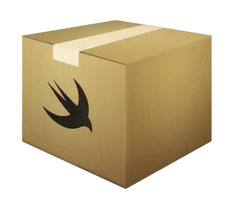

<p align="center">
  
  <br>

  <a href="https://github.com/heroesofcode/spm-swift-package/releases">
    </a>
    
  <a href="https://crates.io/crates/spm-swift-package">
    </a>
    
  <a href="https://github.com/heroesofcode/spm-swift-package/actions/workflows/CI.yml">
    </a>
    
  <a href="https://github.com/heroesofcode/spm-swift-package/actions/workflows/Release.yml">
    </a>
    
  <a href="https://github.com/heroesofcode/spm-swift-package/blob/main/LICENSE">
    </a>
</p>

<p align="center">
  <strong>Command Line Tools for macOS to create Swift Package Manager projects with desirable files.</strong>
</p>

## Features
- 🚀 **Multi-platform:** iOS • macOS • tvOS • watchOS • visionOS  
- 🛠️ **Auto-generated files:** Changelog • Readme • Swift Package Index • SwiftLint  
- ✅ **SwiftLint integration:** Generates `.swiftlint.yml` using the [SwiftLintPlugin](https://github.com/lukepistrol/SwiftLintPlugin)  
- 🧰 **Modern toolchain:** Compatible with Xcode 26.0  
- ⚠️ **No legacy support:** Does not work with older Xcode versions  
- 🖥️ **GUI support:** Optional graphical interface built with [Iced](https://github.com/iced-rs/iced), launched via `spm-swift-package ui`

## Installing

#### Cargo 🦀
Installing from [crates.io](https://crates.io/) (requires Rust/Cargo):

```shell
cargo install spm-swift-package
```

#### Homebrew 🍻
You can install with [Homebrew](https://brew.sh/):

```shell
brew tap heroesofcode/taps
brew install heroesofcode/taps/spm-swift-package
```

## Usage

#### Run cli

```sh
spm-swift-package
```


#### Run UI

```sh
spm-swift-package ui
```


<a href="https://github.com/iced-rs/iced">
  
</a>

<br>
<br>

After generating the Package, it will automatically open in Xcode


And from here you can continue working on your SPM project 🚀 🙂 👨‍💻 👩‍💻

## Contributing

To contribute, just fork this project and then open a pull request, feel free to contribute, bring ideas and raise any problem in the issue tab.

## License

spm-swift-package is released under the MIT license. See [LICENSE](https://github.com/heroesofcode/spm-swift-package/blob/main/LICENSE) for details.