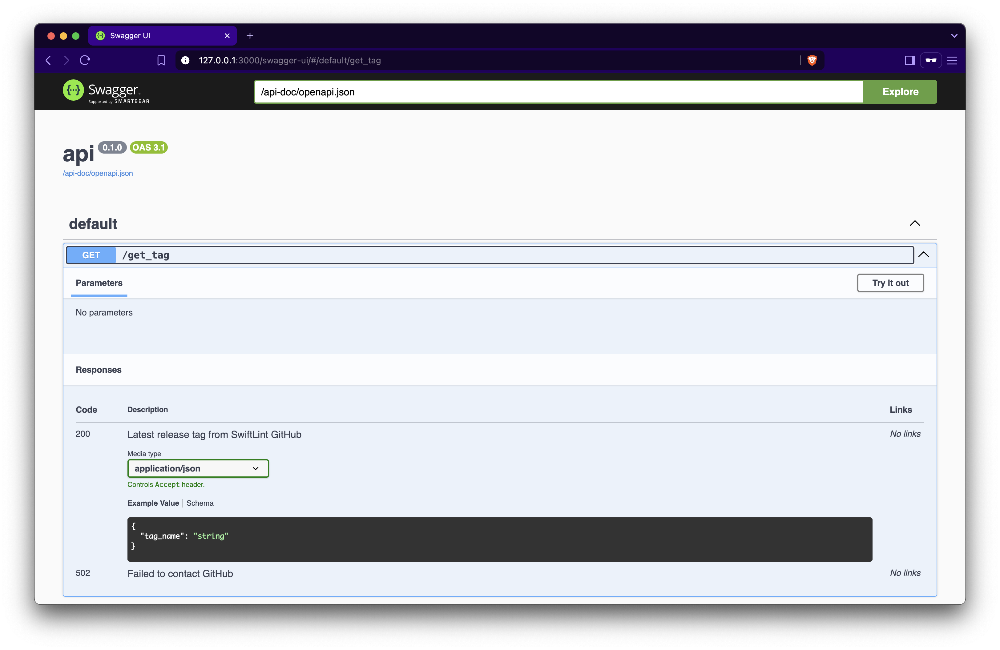

# API

Api module will be used to swiftlint release service with development environment

## Use

You could run with mise tools. If you haven't got mise tools installed, you could run with `cd api && cargo run`.

```sh
mise run api
```

```
🚀 http://127.0.0.1:3000/get_tag
📘 Swagger UI: http://127.0.0.1:3000/swagger-ui
```



## Library

- [axum](https://github.com/tokio-rs/axum)
- [utoipa](https://github.com/juhaku/utoipa)